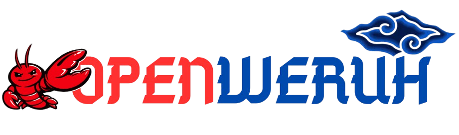
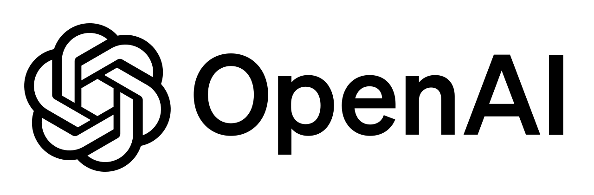
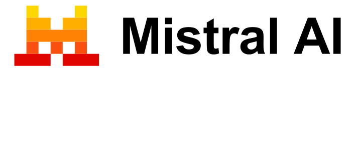

<div align="center">
  

  <br />
  <br />

  **Proactive Screen-Aware Context Layer for OpenClaw**

  <br />

  <a href="https://opensource.org/licenses/MIT"></a>
  <a href="https://www.python.org/downloads/"></a>
  <a href="https://openclaw.ai"></a>
  <a href="#"></a>

  <br />

  > *Weruh* (Javanese) — to see, to know, to understand without being asked.
</div>

---

## Table of Contents

<table width="100%">
  <tr>
    <td width="25%" valign="top">
      <ul>
        <li><a href="#overview">Overview</a></li>
        <li><a href="#the-problem-it-solves">The Problem</a></li>
        <li><a href="#system-architecture">Architecture</a></li>
        <li><a href="#how-it-works-workflow">Workflow</a></li>
      </ul>
      
    </td>
    <td width="25%" valign="top">
      <ul>
        <li><a href="#core-features">Features</a></li>
        <li><a href="#persona-modes">Persona Modes</a></li>
        <li><a href="#deployment-topologies">Deployments</a></li>
      </ul>
      
    </td>
    <td width="25%" valign="top">
      <ul>
        <li><a href="#installation-guide-remote-server--vps">Install Guide</a></li>
        <li><a href="#vision-provider-fallback">Vision Fallback</a></li>
        <li><a href="#security--privacy">Security & Privacy</a></li>
      </ul>
      
    </td>
    <td width="25%" valign="top">
      <ul>
        <li><a href="#roadmap">Roadmap</a></li>
        <li><a href="#author">Author</a></li>
        <li><a href="#license">License</a></li>
      </ul>
      
    </td>
  </tr>
</table>

---

## Overview

**OpenWeruh** is an underlying context layer for the [OpenClaw](https://openclaw.ai) ecosystem. It bridges the gap between the real-time visual context on your screen and the existing intelligence of the OpenClaw agent.

Instead of waiting for you to trigger a command or depending strictly on time-based crons, OpenWeruh allows the agent to observe your workflow and intervene intelligently based on configured persona modes. If you are staring at a bug, reading a controversial claim, or deviating from your goals, OpenWeruh securely feeds that context to your agent.

For an in-depth understanding of the design philosophy, refer to the [Whitepaper v0.1](WHITEPAPER.md).

---

## The Problem It Solves

1.  **Blind Agents**: Standard AI agents can read files, calendars, and APIs, but they cannot see what you are currently working on. If you are reading an article with a false claim, the agent doesn't know.
2.  **Time-Based vs. Context-Based**: OpenClaw's proactivity relies heavily on time-based heartbeats (e.g., every 30 minutes). This is powerful but blind to crucial moments between intervals.
3.  **Reactive Screen Capture**: Existing screen-monitor skills require you to explicitly type *"take a screenshot"*. This is still reactive behavior wrapped in a new interface.
4.  **OS Permissions**: Running headless daemons that need screen capture permissions (especially on macOS) is fundamentally broken. OpenWeruh natively solves this by decoupling the capture daemon from the main OpenClaw Gateway.

---

## System Architecture

<div align="center">
  
</div>
<br/>

OpenWeruh consists of four decoupled components:

```text
openweruh/
├── daemon/    ← Python Screen Daemon (mss + imagehash)
├── skill/     ← OpenClaw AgentSkills instructions (SKILL.md)
├── hook/      ← TypeScript hook to inject tool (gateway:startup)
└── config/    ← Settings for persona, threshold, and active hours
```

1.  **Python Screen Daemon (`daemon/`)**: Captures the screen, applies perceptual hashing (`pHash`) to detect meaningful changes, and securely dispatches the data via Webhooks.
2.  **OpenClaw Skill (`skill/`)**: Instructs the OpenClaw agent on how to react to screen context payloads using defined "Persona Modes."
3.  **Startup Hook (`hook/`)**: Injects the `screen.context` capability into the agent's awareness during the `gateway:startup` event.
4.  **Configuration (`config/`)**: A dedicated `weruh.yaml` file to control sensitivity, active hours, and vision fallbacks.

---

## How It Works (Workflow)

1. **Capture**: Every 15 seconds (configurable), the local Python daemon takes a native screenshot using `mss`.
2. **Change Detection**: It applies perceptual hashing (`pHash`) via `imagehash`. If the screen hasn't changed meaningfully (delta < threshold), the frame is dropped to save API costs.
3. **Dispatch**: If a significant change is detected, the daemon securely POSTs the image to your OpenClaw Gateway's `/hooks/agent` webhook using the `hook:weruh:screen` session.
4. **Analysis & Persona**: OpenClaw processes the image and loads the `openweruh` skill. The agent assumes the configured persona (e.g., `skeptic`, `guardian`) and decides whether an intervention is warranted.
5. **Notification**: If the agent decides to intervene, it sends a proactive message to your active channel (WhatsApp, Telegram, etc.).

---

## Core Features

*   **Change Detection (`pHash`)**: Ensures the agent is only called when significant visual changes occur, minimizing API costs and performance overhead.
*   **Decoupled Operation**: Does not conflict with existing OpenClaw skills or crons.
*   **Text-Only Mode (OCR Scanning)**: For text-only LLMs (which crash with `unknown entries (image)`), OpenWeruh extracts visible text using a local OCR library (Tesseract or EasyOCR) — no LLM needed, no API costs, fully offline.
*   **Vision Provider Fallback**: If OpenClaw's internal image pipeline fails, OpenWeruh falls back to sending a text description via an LLM (OpenAI, Anthropic, Google Gemini, Ollama, etc.).

---

## Persona Modes

OpenWeruh's value lies in its intelligent filtering. The agent adopts a specific persona depending on your needs:

| Mode | Behavior |
| :--- | :--- |
| **`skeptic`** | Scrutinizes news, claims, or facts for bias. Actively searches for counter-arguments and presents them. |
| **`researcher`** | Observes technical reading and automatically provides supporting definitions, related papers, or context. |
| **`focus`** | Monitors activity against a declared session goal. Intervenes if you deviate (e.g., browsing social media while coding). |
| **`guardian`** | Tracks idle time or prolonged usage of distracting applications, gently reminding you to take breaks. |
| **`silent`** | Background recording only. No proactive notifications. Ideal for generating end-of-day activity summaries. |

### Persona Configuration (`weruh.yaml`)

You can fine-tune the agent's behavior, language, and sensitivity in your configuration file:

```yaml
persona:
  mode: "skeptic"                   # skeptic | researcher | focus | guardian | silent
  language: "en"                    # notification language (e.g., en, id)
  tone: "casual"                    # casual | formal
  intervention_threshold: "medium"  # low | medium | high

capture:
  interval_seconds: 15              # time between screenshots
  change_threshold: 10              # pHash distance required to trigger agent
  active_hours: "07:00-23:00"       # prevent capturing during personal time
  notify_after_idle_minutes: 5      # wait for screen to settle before analyzing
```

---

## Deployment Topologies

OpenWeruh supports three deployment architectures:

1.  **Mode A (Local)**: OpenClaw Gateway and the OpenWeruh daemon run on the exact same local machine.
2.  **Mode B (SSH Tunnel)**: OpenClaw runs on a remote VPS, but is bound to `loopback`. You use an SSH tunnel ([`autossh`](https://www.harding.motd.ca/autossh/)) to securely link the local daemon to the server. *(Recommended for high privacy)*.
3.  **Mode C (Remote Public URL)**: OpenClaw runs on a remote server accessible via [Tailscale](https://tailscale.com), [Localtonet](https://localtonet.com), or a standard Reverse Proxy ([Nginx](https://nginx.org) / [Caddy](https://caddyserver.com)). The daemon transmits via HTTPS.

---

## Installation Guide (Remote Server / VPS)

*The following guide assumes **Mode C** (or Mode B with a mapped port) where OpenClaw is running remotely and your workstation is local.*

### Step 1: Server Configuration (OpenClaw)

Enable the webhook interface on your OpenClaw server. Connect to your VPS and run:

```bash
openclaw config set hooks.enabled true
openclaw config set hooks.token "YOUR_SECURE_TOKEN"
openclaw config set hooks.allowRequestSessionKey true
```
*(After setting the config, restart your OpenClaw server. Keep the token safe; it authenticates the incoming images).*

### Step 2: Local Installation (Workstation)

**For Linux & macOS (One-line Install)**
```bash
curl -fsSL https://raw.githubusercontent.com/fikriaf/OpenWeruh/main/scripts/install.sh | bash
```

**Manual Setup (Windows or Manual Configuration)**
On the laptop/PC whose screen you wish to monitor, clone this repository first:

```bash
git clone https://github.com/fikriaf/OpenWeruh.git
cd OpenWeruh
```

#### Windows
1. Install Python dependencies:
   ```cmd
   pip install -r daemon\requirements.txt
   ```
2. Create the configuration directory and copy the template:
   ```cmd
   mkdir "%USERPROFILE%\.config\openweruh"
   copy config\weruh.example.yaml "%USERPROFILE%\.config\openweruh\weruh.yaml"
   ```
3. Copy the OpenClaw skill and hook manually to your OpenClaw directories:
   ```cmd
   xcopy /E /I skill\openweruh "%USERPROFILE%\.openclaw\skills\openweruh"
   xcopy /E /I hook\weruh-boot "%USERPROFILE%\.openclaw\hooks\weruh-boot"
   ```

#### Linux
1. Make the installation script executable:
   ```bash
   chmod +x scripts/*.sh
   ```
2. Run the installer script, which automatically handles dependencies and copies configuration files:
   ```bash
   ./scripts/install.sh
   ```

#### macOS
1. Make the installation script executable:
   ```bash
   chmod +x scripts/*.sh
   ```
2. Run the installer script:
   ```bash
   ./scripts/install.sh
   ```
*Note for macOS: You must explicitly grant "Screen Recording" permissions to your Terminal application (or the Python process running the daemon) in `System Settings > Privacy & Security > Screen Recording`.*

### Step 3: Configure the Daemon

OpenWeruh provides an interactive setup script to easily configure your environment, test connections, and safely store your API keys:

```bash
python daemon/weruh.py setup
```

**Interactive Setup Example:**
```
OpenWeruh Setup
────────────────

  ? Where is your OpenClaw Gateway running?

    1) On this same machine (local)
  > 2) On a remote server (SSH tunnel)
    3) On a remote server (public URL / Tailscale)

  [↑/↓ navigate   Enter confirm]

? Gateway URL [http://127.0.0.1:18789]:
? Hook token (from openclaw.json → hooks.token): ****

  ? How should screen content be analyzed?

  > 1) OpenClaw has a vision-capable AI model (send image directly — recommended)
    2) Text-Only Mode: extract visible TEXT via OCR library (no LLM needed)
    3) Text-Only Mode: use Vision API/LLM to DESCRIBE the screen (fallback if OpenClaw fails)

  [↑/↓ navigate   Enter confirm]

[Option 2 — OCR selected:]

  ? Choose an OCR library:

  > 1) Tesseract OCR (pytesseract) — fastest
    2) EasyOCR — better for complex layouts, slower

  [↑/↓ navigate   Enter confirm]

? OCR language codes (e.g. eng, eng+ind, eng+ara) [eng+ind]:

  [OK] Text-Only Mode enabled using pytesseract. OpenClaw will receive plain text.
  [OK] Configuration saved to ~/.config/openweruh/weruh.yaml
  [OK] OpenWeruh is ready. Run: python daemon/weruh.py start
```

Configuration is automatically saved to `~/.config/openweruh/weruh.yaml` with strict permission `600`. API keys are masked when displayed in the CLI. *(Alternatively, you can still edit the YAML file manually if you prefer).*

### Step 4: Run the Daemon

```bash
python daemon/weruh.py start
```

### Step 5: Optional OpenClaw Integrations

**Daily Summary Cron**  
If you use the `silent` mode or want a recap of your day, you can configure OpenClaw to send you an evening summary of your screen context using its built-in cron system:

```bash
openclaw cron add \
  --name "weruh-daily-summary" \
  --cron "0 21 * * *" \
  --session isolated \
  --message "Summarize today's screen context observations from the weruh session." \
  --announce \
  --channel last
```

**System Event Fallback**  
If webhooks are unavailable, OpenWeruh can fall back to injecting context via the OpenClaw CLI system event:
```bash
openclaw system event --text "[WERUH] Screen context: user is reading about X" --mode now
```

---

## Text-Only Mode & Vision Provider

OpenWeruh handles screen analysis in two distinct modes — choose based on your OpenClaw setup:

### Text-Only Mode (OCR) — Recommended for Text-Only LLMs

If your OpenClaw agent uses a purely text-based LLM (e.g. `step-3.5-flash`), sending images will cause the `tools.profile allowlist contains unknown entries (image)` error. 

OpenWeruh solves this by extracting visible text from screenshots using a local OCR library — no LLM needed, no API costs, fully offline.

```yaml
ocr:
  enabled: true
  library: "pytesseract"   # pytesseract (fast) | easyocr (accurate)
  lang: "eng+ind"          # language codes
```

**Installation:**

> **Tesseract OCR must be installed BEFORE selecting OCR mode in setup.**
> If Tesseract is not found, the setup will show install instructions and exit.

```bash
# 1. Install Tesseract OCR engine (system binary)
# Windows: choco install tesseract -y
#           OR download from https://github.com/UB-Mannheim/tesseract/wiki
# macOS:   brew install tesseract
# Linux:   sudo apt install tesseract-ocr

# 2. Install Python packages
pip install pytesseract pillow

# OR EasyOCR (better accuracy on complex layouts, slower — GPU recommended)
pip install easyocr
```

### Vision Provider (Fallback) — Only When OpenClaw Image Pipeline Fails

If OpenClaw is configured with a vision-capable `imageModel` but the image pipeline fails (e.g. wrong model, dropped frames), OpenWeruh can fall back to a configured Vision Provider to generate a text description.

This is **not** a primary mode — it only activates when OpenClaw's webhook returns an error.

```yaml
vision:
  provider:
    type: "ollama"
    url: "http://localhost:11434/api/chat"
    model: "llava:13b"
```

**Supported providers for fallback:**
<br/>
<div align="center">
  
  
  
  
  <br/>
  
  
  
  
  
</div>

---

## Troubleshooting

### `tools.profile allowlist contains unknown entries (image)`

**Cause:** Your OpenClaw agent profile references the `image` tool, but your current model does not support vision.

**Solutions — pick one:**

1. **Remove `image` from your agent's `tools.profile` allowlist** (recommended):
   ```
   openclaw config set tools.profile.allowlist "shell,grep,file.read,code"
   # remove "image" from the list
   ```

2. **Switch to a text-only model** that doesn't require image tools:
   ```
   openclaw models set-current step-3.5-flash:free
   ```

3. **Set a text-only agent profile** specifically for the `hook:weruh:text` session:
   ```
   openclaw config set sessions.hook:weruh:text.agentProfile text-only
   # (check your OpenClaw docs for the exact syntax)
   ```

### `lane wait exceeded` / agent is slow or stuck

**Cause:** The agent session is overwhelmed by too many webhook triggers.

**Fix:**
- Increase `capture.interval_seconds` in `weruh.yaml` (e.g., `30` or `60`)
- Increase `capture.change_threshold` to only send significant screen changes
- Set active hours to avoid capturing during idle time

### `Skipping skill path that resolves outside its configured root`

**Cause:** Windows is case-sensitive with symlinks/junctions pointing to `%USERPROFILE%`.

**Fix:** Copy the skill folder directly instead of using symlinks:
```cmd
# Instead of creating a junction, copy the folder
xcopy /E /I skill\openweruh "%USERPROFILE%\.openclaw\skills\openweruh"
```

### Tesseract OCR not found on startup

```
[X] OCR is enabled but Tesseract is not installed or not in PATH.
```

Install Tesseract OCR first:
```
Windows: choco install tesseract -y
         OR download from https://github.com/UB-Mannheim/tesseract/wiki
macOS:   brew install tesseract
Linux:   sudo apt install tesseract-ocr
```

---

## Security & Privacy

Data never leaves your machine without explicit permission.

*   **No Permanent Storage**: Screenshots are temporarily saved to `/tmp/weruh-frame.jpg` and immediately overwritten.
*   **Direct Transmission**: In the primary path, images are sent directly to your own OpenClaw gateway. No third-party servers are involved.
*   **Safeguards**: Active hours prevent capturing during personal time, and the change threshold prevents capturing highly repetitive frames. API keys are stored locally with `600` permissions.

---

## Roadmap

- [x] **v0.1**: Foundation (Python daemon, pHash detection, SKILL.md, Webhook integration, OCR Text-Only Mode).
- [ ] **v0.2**: Vision Intelligence enhancements (Multi-provider fallback support integration, daily summary crons).
- [ ] **v0.3**: Advanced Context (Session goals, browser extensions for DOM context, history dashboard).

---

## Author

**Fikri Armia Fahmi (FikriAF)**

<br/>
<a href="mailto:fikriarmia27@gmail.com"></a>
<a href="https://www.linkedin.com/in/fikri-armia-fahmi-b373b3288/"></a>
<a href="https://faftech.net"></a>

---

## License

This project is licensed under the [MIT License](LICENSE).
